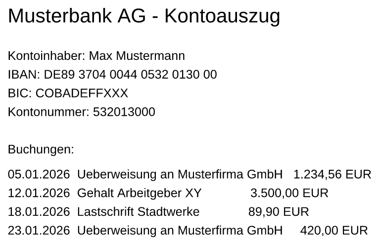
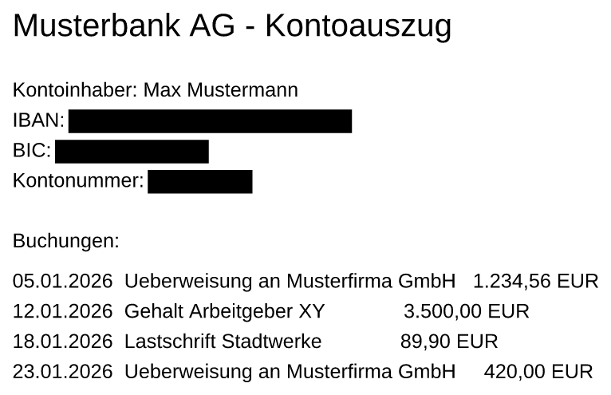
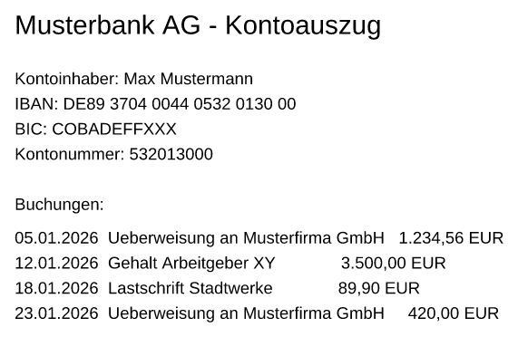
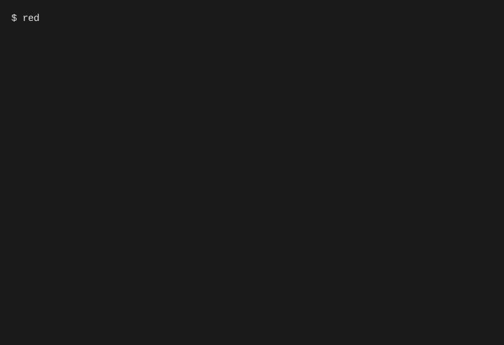

# Vorher / Nachher — der Beleg

Vier Belege, alle aus echten Läufen: zwei Standbilder, zwei Animationen.
Gerendert hat sie der Rasterizer dieses Programms (`redact-render`), erzeugt
ein einziger Befehl (`./scripts/make-preview.sh`). Kein Bildbearbeitungsprogramm
war beteiligt, und keine Zeile Ausgabe ist abgetippt.

* [Vorher / nachher als Standbild](#was-man-auf-dem-rechten-bild-sieht--und-was-nicht)
* [Bewegt: die Schwärzung, wie sie entsteht](#bewegt-die-schwärzung-wie-sie-entsteht)
* [Bewegt: der Lauf in der Konsole](#bewegt-der-lauf-in-der-konsole)
* [Selber nachbauen](#selber-nachbauen) · [Was an den Bildern gemacht wurde](#was-an-den-bildern-gemacht-wurde--vollständig)
* [Keine Animation der Oberfläche — und warum](#keine-animation-der-oberfläche--und-warum)

---

Zwei Bilder derselben Seite. Dazwischen liegt ein einziger Aufruf ohne
Sonderoptionen:

```console
$ redact-rs --write-demo kontoauszug.pdf
$ redact-rs kontoauszug.pdf
```

<table>
<tr>
<th width="50%">vorher — <code>kontoauszug.pdf</code></th>
<th width="50%">nachher — <code>kontoauszug_geschwaerzt.pdf</code></th>
</tr>
<tr>
<td></td>
<td></td>
</tr>
</table>

## Was man auf dem rechten Bild sieht — und was nicht

Drei schwarze Balken. So weit sieht das aus wie jedes andere Werkzeug: ein
Rechteck über den Text legen kann ein Textverarbeitungsprogramm auch.

**Der Unterschied ist nichts, was man auf dem Bild sehen könnte.** Er liegt
darunter, im Inhalt der Datei. Genau deshalb steht neben den Bildern eine
zweite Datei: [`pruefung.txt`](pruefung.txt) — die ungekürzte Ausgabe von
`redact-rs --check-leaks` an denselben beiden Dateien, aus demselben Lauf, der
auch die Bilder erzeugt hat.

Vorher stehen alle vier gesuchten Texte in der Datei:

```
Geprüft: kontoauszug.pdf (1862 Byte)
  GEFUNDEN (7 Fundstelle(n)): DE89 3704 0044 0532 0130 00
  GEFUNDEN (5 Fundstelle(n)): COBADEFFXXX
  GEFUNDEN (5 Fundstelle(n)): 532013000
  GEFUNDEN (13 Fundstelle(n)): Max Mustermann
```

Nachher drei davon nicht mehr — auf keiner der Ebenen, auf denen
`--check-leaks` sucht: Rohbytes, Altrevisionen, komprimierte Objektströme,
Zeichenketten-Objekte, und das in Latin-1 wie in UTF-16BE:

```
Geprüft: kontoauszug_geschwaerzt.pdf (1332 Byte)
  nicht gefunden: DE89 3704 0044 0532 0130 00
  nicht gefunden: COBADEFFXXX
  nicht gefunden: 532013000
  GEFUNDEN (6 Fundstelle(n)): Max Mustermann
```

Wie das im Seiteninhalt aussieht, zeigt `--check-leaks` selbst. Es reiht in
den Zeilen „Zeichenketten-Verkettung, ohne Leerraum“ alle Textstücke des
Seiten-Streams aneinander — links vor, rechts nach der Schwärzung, beide aus
`pruefung.txt` abgeschrieben:

```
vorher:   …KontoauszugKontoinhaber:MaxMustermannIBAN:DE89370400440532013…
nachher:  …KontoauszugKontoinhaber:MaxMustermannIBAN:BIC:Kontonummer:Buc…
```

Hinter `IBAN:` kommt nichts mehr. Nicht verdeckt, nicht unsichtbar gefärbt,
nicht in ein anderes Objekt verschoben — weg. Der schwarze Balken davor ist
nur die Anzeige dieses Umstands, nicht seine Ursache.

> Die Byte-Größen in den beiden Kästen oben (1862 → 1332) taugen **nicht** als
> Beweis, auch wenn sie in die richtige Richtung zeigen: die Ausgabe wird
> zusätzlich Flate-komprimiert, die Eingabe aus `--write-demo` ist es nicht.
> Der Vergleich misst hier also zwei Dinge auf einmal.

## Was dieses Werkzeug **nicht** kann, und warum es hier steht

**„Max Mustermann“ steht auf dem rechten Bild noch da.** Das ist kein Fehler
in den Bildern und keine schlecht gewählte Demo: es gibt kein eingebautes
Muster für Namen und keine Named-Entity-Erkennung. Kontoinhaber, Empfänger,
Arbeitgeber und Verwendungszwecke bleiben stehen, solange sie nicht über die
Buchungsliste, eine manuelle Region (`--manual-regions`) oder die Oberfläche
erfasst werden. Die README sagt das unter
„[Was dieses Werkzeug nicht leistet → Erkennung](../README.md#erkennung)“ mit
allen Einzelheiten.

Der Beleg zeigt es absichtlich mit. Ein Vorher/Nachher-Bild, das nur die
gelungenen Fälle zeigt, wäre eine Werbung; wer danach seinen echten Auszug
durchlaufen lässt und den Namen darauf vergisst, hätte sich auf ein Bild
verlassen, das mehr versprochen hat, als das Programm hält.

## Und die verbreitete Kontrolle?

In `pruefung.txt` steht als Letztes eine Gegenprobe mit `pdftotext … | grep …`
— und die meldet an genau dieser Datei „kein Treffer“, während der Name noch
darin steht. Sie steht dort als **Warnung**, nicht als Beweis. Warum sie nicht
taugt — grep prüft eine Zeichenkette, `pdftotext` sieht nur Seitentext und
weder Objektströme noch Altrevisionen — erklärt die README unter
„[`pdftotext … | grep …` taugt dafür nicht](../README.md#pruefen)“.

## Bewegt: die Schwärzung, wie sie entsteht



Vier Einzelbilder, vier **wirklich geschriebene PDF-Dateien**. Hier wird nichts
überblendet und nichts eingezeichnet: Bild *n* ist der Render der Datei, die
Lauf *n* auf die Platte gelegt hat, und jede dieser Dateien ließe sich einzeln
mit `--check-leaks` prüfen.

Der Preis dafür, ausdrücklich: der **gewöhnliche Aufruf macht alle
Schwärzungen auf einmal**. Damit eine nach der anderen dazukommt, laufen vier
Aufrufe mit verschiedener Musterauswahl — sie stehen in `pruefung.txt` und in
`scripts/make-preview.sh`:

| Einzelbild | Aufruf | Schwärzungen |
|---|---|---|
| 1 | `redact-rs kontoauszug.pdf --no-patterns` | 0 |
| 2 | `redact-rs kontoauszug.pdf --patterns iban_de` | 2 |
| 3 | `redact-rs kontoauszug.pdf --patterns iban_de,bic` | 3 |
| 4 | `redact-rs kontoauszug.pdf --patterns iban_de,bic,konto_nr` | 4 |

(Die Zahlen zählen beide Seiten; auf der gezeigten Seite 1 sind es 0, 1, 2, 3.)

Auch hier bleibt „Max Mustermann“ bis zuletzt stehen.

## Bewegt: der Lauf in der Konsole



**Der Befehl ist getippt, die Antwort nicht.** Jede Ausgabezeile im Bild hat
ein echter Lauf gedruckt; `scripts/make-preview.sh` hat sie mitgeschnitten und
nur ein Präfix davorgesetzt. Der Mitschnitt liegt daneben:
[`konsole.txt`](konsole.txt) — Zeile für Zeile vergleichbar mit dem, was im
Bild steht. Auch der Rückgabewert am Schluss wird nicht behauptet, sondern
noch einmal geholt.

Die Schrift setzt der Font-Rasterizer dieses Programms
(`redact_render::fonts`), derselbe, der auch die Seitenvorschau zeichnet. Es
ist kein Bildschirmfoto.

Dass die Antwort mit `Rückgabewert 0` endet, ist übrigens keine Entwarnung —
das Programm sagt in derselben Ausgabe selbst, warum nicht.

## Selber nachbauen

Ein Befehl, keine Handarbeit:

```console
$ ./scripts/make-preview.sh
```

Das Skript baut das Programm und die drei Belegwerkzeuge, schreibt die
Beispieldatei mit `--write-demo`, schwärzt sie (einmal gewöhnlich, viermal
gestaffelt für die Animation), rendert die Seiten, schneidet den Konsolenlauf
mit und schreibt die Prüfausgaben. Es überschreibt genau die sechs erzeugten
Dateien in diesem Verzeichnis und sonst nichts:

```
vorher.png  nachher.png  schwaerzung.gif  konsole.gif  konsole.txt  pruefung.txt
```

Einzeln geht es auch:

```console
$ cargo run -p redact-render --example page_to_png -- \
      --page 1 --width 1500 --crop \
      kontoauszug.pdf             vorher.png \
      kontoauszug_geschwaerzt.pdf nachher.png

$ cargo run -p redact-render --example redaction_gif -- \
      --page 1 --width 1100 --crop \
      schritt0.pdf schritt1.pdf schritt2.pdf schritt3.pdf  schwaerzung.gif

$ cargo run -p redact-render --example console_gif -- konsole.txt konsole.gif
```

### Wie zuverlässig ist „nachbauen“?

**Auf derselben Maschine: bitgleich.** Vier vollständige Läufe haben hier
dieselben SHA-256-Summen für alle fünf erzeugten Bild- und Textdateien
geliefert. Weder PNG noch GIF tragen einen Zeitstempel, und die Palette wird
sortiert aufgebaut, damit die Durchlaufreihenfolge nichts ändert.

**Über Maschinengrenzen: nicht zugesagt.** Drei Stellen können Bytes
verschieben, ohne dass jemand etwas falsch macht:

* `tiny-skia` rastert mit SIMD — SSE auf x86_64, NEON auf aarch64. An
  kantengeglätteten Rändern kann daraus ein Grauwert Unterschied werden.
* Fließkomma-Codegen darf sich zwischen `rustc`-Fassungen ändern. Die
  Toolchain ist zwar in `rust-toolchain.toml` festgenagelt — aber eine
  Anhebung dort ändert dann eben auch die Bilder.
* Die PNG-Kompression kommt über `Cargo.lock` aus flate2/miniz_oxide. Eine
  Aktualisierung der Sperrdatei ändert PNG-Bytes, ohne dass ein Pixel anders
  wäre. (Das GIF nicht — dessen LZW steht im Beispielprogramm selbst.)

Deshalb prüft die CI **nicht** auf Bytegleichheit. Sie erzeugt die Belege neu
und lässt beide Sätze — den frisch erzeugten und den eingecheckten — durch
`scripts/check-preview.py` laufen: ein zweiter, unabhängiger Leser in Python,
damit ein Fehler im eigenen Schreiber sich nicht selbst durchwinkt. Geprüft
wird, was zusagbar ist: dass die Dateien entstehen, Maße und Einzelbildzahlen
stimmen, **kein Einzelbild leer ist**, jeder Schritt der Schwärzungs-Animation
wirklich mehr schwärzt als der vorige und die mitgeschnittenen Rückgabewerte
stimmen.

Was das nicht leistet: es merkt nicht, wenn die eingecheckten Bilder veralten.
Dagegen hilft nur der Lauf selbst — `git status` sagt es danach.

```console
$ ./scripts/make-preview.sh && git status --short docs/
$ python3 scripts/check-preview.py docs
```

## Was an den Bildern gemacht wurde — vollständig

Damit niemand raten muss, wie viel Bildbearbeitung dazwischensteckt: gar
keine. Die Eingriffe sind diese, und alle macht ein Beispielprogramm, nicht
eine Hand:

1. **Zuschnitt.** Die Seite wird mit 1500 px (Standbilder) bzw. 1100 px
   (Animation) Breite gerendert und auf den beschriebenen Teil zugeschnitten;
   der Rest der A4-Seite ist leer. Der Ausschnitt ist innerhalb einer Gruppe
   für **alle** Bilder derselbe, berechnet aus der Vereinigung ihrer Inhalte —
   getrennt zugeschnitten wären die Bilder verschieden vergrößert, und der
   Vergleich zeigte einen Unterschied, den die Schwärzung gar nicht gemacht
   hat. Bei einer Animation wäre es noch schlimmer: ein wandernder Ausschnitt
   sähe aus wie eine Kamerafahrt, die nie stattgefunden hat.
2. **Graustufen.** Die Seite ist grau, also wird ein Graustufen-PNG
   geschrieben (ein Byte je Pixel statt vier). Fände sich ein einziges
   farbiges Pixel, schriebe das Programm RGB.
3. **PNG-Zeilenfilter** nach dem Standardverfahren, damit die Dateien klein
   bleiben.
4. **GIF-Einzelbilder sind Differenzen.** Nur das erste Einzelbild ist
   vollständig; jedes weitere trägt genau das Rechteck, in dem es sich vom
   vorigen unterscheidet. Das ist verlustfrei und der Grund für die kleinen
   Dateien.
5. **Die GIF-Palette wird nicht geraten.** Übliche GIF-Erzeuger quantisieren
   und dithern, bis 256 Farben reichen. Hier wird gezählt: passen die
   tatsächlich vorkommenden Farben in die Palette, ist sie exakt und das GIF
   pixelgenau dasselbe Bild — passen sie nicht, bricht der Schreiber ab. Ein
   gedithertes Belegbild zeigte etwas, das der Rasterizer nie gezeichnet hat.
   (Gemessen: beide Animationen kommen mit 32 Farben aus.)

Gemessene Größen:

| Datei | Maße | Einzelbilder | Bytes |
|---|---|---|---|
| `vorher.png` | 766 × 495 | — | 25 935 |
| `nachher.png` | 766 × 495 | — | 22 380 |
| `schwaerzung.gif` | 571 × 372 | 4 (8,3 s) | 18 033 |
| `konsole.gif` | 720 × 494 | 60 (10,4 s) | 25 196 |
| `konsole.txt` | — | — | 1 338 |
| `pruefung.txt` | — | — | 7 462 |

Nicht gemacht: Beschriftungen ins Bild, Pfeile, Rahmen, Hervorhebungen,
gezeichnete Mauszeiger, Zusammensetzen zu einer Montage, Nachschärfen,
Aufhellen, Überblendungen, Blinken. Beide Animationen laufen zwar in Schleife,
halten aber am Schluss mehrere Sekunden still — der letzte Zustand ist die
Aussage.

## Keine Animation der Oberfläche — und warum

Naheliegend wäre eine dritte Animation: das Fenster, in dem man ein Rechteck
über den Namen zieht. Sie fehlt, und das ist gemessen, nicht geschätzt.

* Die Oberfläche startet auf einem Rechner ohne Bildschirm hier gar nicht.
  Unter `xvfb-run` bricht sie ab, bevor ein Fenster entsteht:
  `Library libxkbcommon-x11.so could not be loaded` (winit über
  `xkbcommon-dl`). Software-OpenGL wäre vorhanden (Mesa `swrast`), die
  Tastaturbibliothek nicht.
* Der Weg an eframe vorbei — egui kopflos laufen lassen und die Zeichenbefehle
  selbst rastern — ist versperrt: `eframe::Frame` hat ausschließlich
  `pub(crate)`-Felder, und `RedactApp::update` verlangt genau davon eine
  veränderliche Referenz. Ohne Änderung an fremdem Quelltext ist die Funktion
  von außen nicht aufrufbar.
* Selbst mit Fenster bliebe das Bedienen: eframe 0.29 bietet keinen
  unterstützten Weg, Maus- und Tastaturereignisse von innen einzuspeisen. Was
  dabei herauskäme, wäre eine nachgestellte Bedienung — also genau die Sorte
  Bild, die hier sonst abgelehnt wird.

Ein nachgebautes Fenster wäre schnell gezeichnet und sähe gut aus. Es wäre
aber kein Beleg, sondern eine Illustration, und dieses Verzeichnis heißt nicht
umsonst anders.
